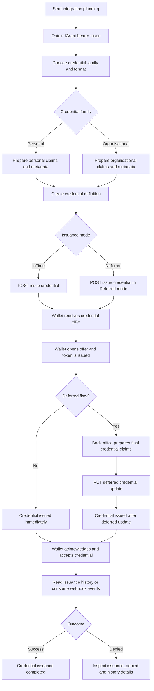

# iGrant Product API Plan for Issuing Custom Credentials to EUDI Wallets

## Scope

This document defines the first implementation plan for issuing our custom credentials to EUDI-compatible wallets using the iGrant Product API.

Initial scope:

- Issuer-side Product API calls only
- Both personal and organisational credential issuance
- SD-JWT VC first, JWT VC second
- InTime and Deferred issuance modes only
- Dynamic issuance, holder-side simulation, and mDoc are out of scope for the first Bruno import

Base assumptions from the iGrant docs:

- Base URL: `https://api.igrant.io`
- Authentication: `Authorization: Bearer <TOKEN>`
- Bruno implementation choice: use Bruno `apikey` auth mode to populate the `Authorization` header with `Bearer {{apiKey}}`
- Shared issuer API surface for both personal and organisational flows
- Main differences between personal and organisational issuance are the credential payload, type metadata, display metadata, trust anchor choices, and Wallet Unit Attestation expectations

Reference docs:

- Product docs root: `https://docs.igrant.io/docs/`
- Create credential definition: `https://docs.igrant.io/docs/openid4vc-api/config-create-digital-wallet-open-id-credential-definition`
- Issue credential: `https://docs.igrant.io/docs/openid4vc-api/config-digital-wallet-open-id-issue-credential`
- Issue deferred credential: `https://docs.igrant.io/docs/openid4vc-api/config-update-digital-wallet-open-id-credential-history`
- Read issuance history: `https://docs.igrant.io/docs/openid4vc-api/config-read-digital-wallet-open-id-credential-history`
- List issuance history: `https://docs.igrant.io/docs/openid4vc-api/config-list-digital-wallet-open-id-credential-history`
- Webhooks: `https://docs.igrant.io/docs/openid4vc-webhooks/`

## Outcome

The immediate goal is to agree the request sequence and payload structure so the same sequence can be imported into Bruno as ordered requests and environments.

## Planned API Sequence

### 1. Common setup

Before issuing credentials, we need:

1. iGrant bearer token from vendor onboarding or support
2. Agreed webhook endpoint strategy
3. Signing key and trust-anchor choice for each credential family
4. Example claim payloads for personal and organisational credentials

Notes:

- The webhook documentation references webhook management APIs, but the concrete CRUD endpoint paths do not appear to be published in the docs. For the first iteration, we should plan around webhook consumption plus issuance-history polling.
- Both personal and organisational issuance can use the same API sequence.

### 2. Create a credential definition

Create one credential definition per credential family and format.

Endpoint:

- `POST /v2/config/digital-wallet/openid/sdjwt/credential-definition`

Purpose:

- Defines credential format, schema, claims, expiration, revocation behaviour, issuer display metadata, trust anchor, and protocol version.

Key request fields to decide:

- `label`
- `version`
- `trustAnchor`
- `kid`
- `enforceWUA`
- `credentialDefinitions[]`
- `credentialDefinitions[].credentialFormat`
- `credentialDefinitions[].type` for JWT VC
- `credentialDefinitions[].vct` for SD-JWT VC
- `credentialDefinitions[].expirationInDays`
- `credentialDefinitions[].supportRevocation`
- `credentialDefinitions[].revocationMethod`
- `credentialDefinitions[].display`
- `credentialDefinitions[].claims`
- `credentialDefinitions[].validationPath`

Planned definition variants:

1. Personal custom credential, SD-JWT VC
2. Personal custom credential, JWT VC
3. Organisational custom credential, SD-JWT VC
4. Organisational custom credential, JWT VC

Expected output:

- `credentialDefinitionId`

### 3. Start InTime issuance

Use this when the credential can be issued immediately.

Endpoint:

- `POST /v2/config/digital-wallet/openid/sdjwt/credential/issue`

Required request shape:

- `issuanceMode: "InTime"`
- `urlScheme: "openid-credential-offer://"`
- `credentialDefinitionId`
- `credentials[]`
- `credentials[].id`
- `credentials[].claims`
- Optional `credentialOfferEndpoint`

Expected output:

- `credentialExchangeId`
- Credential-offer details for QR code or deep-link delivery
- Issuance-history object that can be polled later

Typical use:

- Personal credential where claim values already exist in our system
- Organisational credential where legal-person data is already verified and ready to sign

### 4. Start Deferred issuance

Use this when a background approval, enrichment, or verification step is required before final issuance.

Endpoint:

- `POST /v2/config/digital-wallet/openid/sdjwt/credential/issue`

Required request shape:

- `issuanceMode: "Deferred"`
- `urlScheme: "openid-credential-offer://"`
- `credentialDefinitionId`
- Optional initial `credentials[]` depending on how much data is ready
- Optional `credentialOfferEndpoint`

Expected output:

- `credentialExchangeId`
- Credential-offer details for wallet pickup

Operational expectation:

- The exchange moves forward until the wallet has received the offer and token phase is complete.
- Final credential material is supplied later using the deferred update call.

### 5. Complete Deferred issuance

When the pending credential data is ready, update the exchange with the final claims.

Endpoint:

- `PUT /v2/config/digital-wallet/openid/sdjwt/credential/history/:credentialExchangeId`

Required request shape:

- Path parameter `credentialExchangeId`
- `credential.id`
- `credential.claims`

Expected output:

- Updated issuance-history object

Typical use:

- Internal back-office approval completed
- External verification completed
- Organisational authority approved release of credential data

### 6. Monitor issuance state

Primary endpoints:

- `GET /v2/config/digital-wallet/openid/sdjwt/credential/history/:credentialExchangeId`
- `GET /v2/config/digital-wallet/openid/sdjwt/credential/history`

Purpose:

- Confirm exchange state if webhook delivery is not yet integrated or if diagnosis is needed

Expected lifecycle events and states:

1. Offer created and sent
2. Offer opened by wallet
3. Token issued
4. Credential issued
5. Credential acknowledged by wallet
6. Credential accepted by holder
7. Failure case: issuance denied

Related webhook events from docs:

- `openid.credential.offer_sent`
- `openid.credential.offer_received`
- `openid.credential.token_issued`
- `openid.credential.credential_issued`
- `openid.credential.credential_acked`
- `openid.credential.credential_accepted`
- `openid.credential.credential_deleted`
- `openid.credential.issuance_denied`

### 7. Optional later step: revocation status

This is not part of the first Bruno flow, but the endpoint should be noted now.

Endpoint:

- `PUT /v2/config/digital-wallet/openid/sdjwt/credential/history/:credentialExchangeId/revocation-status`

Use this later if we enable revocation for the issued credentials.

## Personal vs Organisational Planning

The API sequence is the same for both categories. The difference is in the credential definition and claim payloads.

### Personal credential track

Recommended starting point:

- A PID-like custom credential aligned with natural-person identity or entitlement data

Planned payload concerns:

- Person-oriented claim names
- Individual display text and branding
- Possible WUA enforcement depending on target wallet policy
- SD-JWT selective-disclosure choices for sensitive attributes

Candidate examples:

- Personal identity profile
- Employee identity credential
- Member entitlement credential

### Organisational credential track

Recommended starting point:

- A VAT attestation credential derived from the source document and mapped into a reusable JSON schema

Planned payload concerns:

- Legal entity identifiers
- Registered legal name and status fields
- Organisational display text and branding
- Possible stronger trust-anchor and issuance policy settings

Candidate examples:

- VAT attestation credential
- Registration attestation
- Authorised representative or licence credential

Schema source for this exercise:

- `schemas/vat-attestation-credential.schema.json`

## Proposed First Credential Set

To make the first Bruno collection concrete, use one example credential per audience:

1. Personal: `EmployeeIdentityCredential`
2. Organisational: `VatAttestationCredential`

Reasoning:

- Both are custom credentials rather than direct copies of PID or LPID.
- Both remain close enough to the EUDI patterns in the iGrant docs to reduce integration risk.
- Both can be expressed cleanly in SD-JWT VC and JWT VC.

### Personal example: EmployeeIdentityCredential

Recommended claim set:

- `employee_id`
- `given_name`
- `family_name`
- `email`
- `job_title`
- `department`
- `employment_status`
- `organisation_name`

Recommended SD-JWT VC metadata:

- `credentialFormat: "dc+sd-jwt"`
- `vct: "urn:we-build:credential:employee-identity:1"`
- `trustAnchor: "did:key"`
- `version: "version_01"`
- `validationPath: "$"`

Recommended JWT VC metadata:

- `credentialFormat: "jwt_vc_json"`
- `type: ["VerifiableCredential", "EmployeeIdentityCredential"]`
- `trustAnchor: "did:key"`
- `version: "version_01"`
- `validationPath: "$.vc.credentialSubject"`

Example credential-definition body for SD-JWT VC:

```json
{
    "label": "Employee Identity",
    "trustAnchor": "did:key",
    "version": "version_01",
    "kid": "{{issuerKid}}",
    "enforceWUA": false,
    "credentialDefinitions": [
        {
            "label": "Employee Identity - SD-JWT",
            "expirationInDays": 365,
            "supportRevocation": true,
            "revocationMethod": "status_list",
            "enforceCredentialUniqueness": false,
            "supportCredentialReissuance": false,
            "credentialBindingMethods": ["did:key", "jwk", "x5c", "kid"],
            "authorizationRequestType": "authorization_details",
            "display": {
                "name": "Employee Identity",
                "description": "Employment identity credential for use in EUDI-compatible wallets.",
                "backgroundColor": "#F3F7F4",
                "textColor": "#102A1F"
            },
            "credentialResponseInterval": 5,
            "credentialFormat": "dc+sd-jwt",
            "vct": "urn:we-build:credential:employee-identity:1",
            "claims": {
                "claims": [
                    { "path": ["employee_id"], "mandatory": true, "limitDisclosure": true },
                    { "path": ["given_name"], "mandatory": true, "limitDisclosure": true },
                    { "path": ["family_name"], "mandatory": true, "limitDisclosure": true },
                    { "path": ["email"], "mandatory": true, "limitDisclosure": true },
                    { "path": ["job_title"], "mandatory": true, "limitDisclosure": true },
                    { "path": ["department"], "mandatory": false, "limitDisclosure": true },
                    { "path": ["employment_status"], "mandatory": true, "limitDisclosure": true },
                    { "path": ["organisation_name"], "mandatory": true, "limitDisclosure": true }
                ]
            },
            "validationPath": "$"
        }
    ],
    "userPin": ""
}
```

Example issue body for InTime issuance:

```json
{
    "issuanceMode": "InTime",
    "urlScheme": "openid-credential-offer://",
    "credentialDefinitionId": "{{personalCredentialDefinitionIdSdJwt}}",
    "credentials": [
        {
            "id": "employee-identity-v1",
            "claims": {
                "employee_id": "EMP-001245",
                "given_name": "Anna",
                "family_name": "Korhonen",
                "email": "anna.korhonen@we-build.example",
                "job_title": "Project Manager",
                "department": "Delivery",
                "employment_status": "active",
                "organisation_name": "We Build Oy"
            }
        }
    ]
}
```

### Organisational example: VatAttestationCredential

Recommended claim set:

- `VAT_ID`
- `Administrative_Unit_Name`
- `Administrative_Unit_Type`
- `Administrative_Unit_Address`
- `Validity_Area_Limitation`
- `Validity_Period`
- `Economic_Activity_Type`
- `Economic_Operator`
- `Issuer`

Schema alignment:

- Use the structure in `schemas/vat-attestation-credential.schema.json` as the source of truth for the credential claims.
- The credential-definition `claims.claims[].path` entries should mirror the top-level properties and nested objects defined in that schema.
- The example issuance payload should validate against that schema before being used in Bruno.

Recommended SD-JWT VC metadata:

- `credentialFormat: "dc+sd-jwt"`
- `vct: "urn:we-build:credential:vat-attestation:1"`
- `trustAnchor: "did:key"` initially, with `did:web` as a likely later production choice
- `version: "version_01"`
- `validationPath: "$"`

Recommended JWT VC metadata:

- `credentialFormat: "jwt_vc_json"`
- `type: ["VerifiableCredential", "VatAttestationCredential"]`
- `trustAnchor: "did:key"`
- `version: "version_01"`
- `validationPath: "$.vc.credentialSubject"`

Example credential-definition body for JWT VC:

```json
{
    "label": "VAT Attestation",
    "trustAnchor": "did:key",
    "version": "version_01",
    "kid": "{{issuerKid}}",
    "enforceWUA": false,
    "credentialDefinitions": [
        {
            "credentialFormat": "jwt_vc_json",
            "type": ["VerifiableCredential", "VatAttestationCredential"],
            "credentialDefinition": {
                "label": "VAT Attestation - JWT VC",
                "expirationInDays": 365,
                "supportRevocation": true,
                "revocationMethod": "status_list_2021",
                "enforceCredentialUniqueness": false,
                "supportCredentialReissuance": false,
                "credentialBindingMethods": ["did:key", "jwk", "x5c", "kid"],
                "authorizationRequestType": "authorization_details",
                "display": {
                    "name": "VAT Attestation",
                    "description": "VAT identification attestation for an administrative unit of an economic operator.",
                    "backgroundColor": "#EEF4FA",
                    "textColor": "#18324A"
                },
                "credentialResponseInterval": 5,
                "credentialFormat": "jwt_vc_json",
                "claims": [
                    { "path": ["credentialSubject", "VAT_ID"], "mandatory": true },
                    { "path": ["credentialSubject", "Administrative_Unit_Name"], "mandatory": true },
                    { "path": ["credentialSubject", "Administrative_Unit_Type"], "mandatory": false },
                    { "path": ["credentialSubject", "Administrative_Unit_Address"], "mandatory": false },
                    { "path": ["credentialSubject", "Validity_Area_Limitation"], "mandatory": false },
                    { "path": ["credentialSubject", "Validity_Period"], "mandatory": true },
                    { "path": ["credentialSubject", "Economic_Activity_Type"], "mandatory": false },
                    { "path": ["credentialSubject", "Economic_Operator"], "mandatory": true },
                    { "path": ["credentialSubject", "Issuer"], "mandatory": true }
                ],
                "validationPath": "$.vc.credentialSubject"
            }
        }
    ]
}
```

Note: the published example and the live request schema currently diverge for `jwt_vc_json`. The live API expects each `credentialDefinitions[]` entry to include the outer `credentialFormat` discriminator, the W3C VC `type` array, and a nested `credentialDefinition` object. Within that nested object, `claims` is a direct array for JWT VC rather than the SD-JWT-style wrapper object.
For JWT VC offers to be wallet-compatible, those claim paths must be rooted at `credentialSubject` when the validation path is `$.vc.credentialSubject`.

Example credential-definition body for SD-JWT VC:

```json
{
    "label": "VAT Attestation",
    "trustAnchor": "did:key",
    "version": "version_01",
    "kid": "{{issuerKid}}",
    "enforceWUA": false,
    "credentialDefinitions": [
        {
            "label": "VAT Attestation - SD-JWT",
            "expirationInDays": 365,
            "supportRevocation": true,
            "revocationMethod": "status_list",
            "enforceCredentialUniqueness": false,
            "supportCredentialReissuance": false,
            "credentialBindingMethods": ["did:key", "jwk", "x5c", "kid"],
            "authorizationRequestType": "authorization_details",
            "display": {
                "name": "VAT Attestation",
                "description": "VAT identification attestation for an administrative unit of an economic operator.",
                "backgroundColor": "#EEF4FA",
                "textColor": "#18324A"
            },
            "credentialResponseInterval": 5,
            "credentialFormat": "dc+sd-jwt",
            "vct": "urn:we-build:credential:vat-attestation:1",
            "claims": {
                "claims": [
                    { "path": ["VAT_ID"], "mandatory": true, "limitDisclosure": true },
                    { "path": ["Administrative_Unit_Name"], "mandatory": true, "limitDisclosure": true },
                    { "path": ["Administrative_Unit_Type"], "mandatory": false, "limitDisclosure": true },
                    { "path": ["Administrative_Unit_Address"], "mandatory": false, "limitDisclosure": true },
                    { "path": ["Validity_Area_Limitation"], "mandatory": false, "limitDisclosure": true },
                    { "path": ["Validity_Period"], "mandatory": true, "limitDisclosure": true },
                    { "path": ["Economic_Activity_Type"], "mandatory": false, "limitDisclosure": true },
                    { "path": ["Economic_Operator"], "mandatory": true, "limitDisclosure": true },
                    { "path": ["Issuer"], "mandatory": true, "limitDisclosure": true }
                ]
            },
            "validationPath": "$"
        }
    ]
}
```

Example issue body for Deferred issuance:

```json
{
    "issuanceMode": "Deferred",
    "urlScheme": "openid-credential-offer://",
    "credentialDefinitionId": "{{orgCredentialDefinitionIdJwtVc}}",
    "userPin": ""
}
```

Example deferred completion body:

```json
{
    "credential": {
        "id": "vat-attestation-v1",
        "claims": {
            "VAT_ID": "FI12345678",
            "Administrative_Unit_Name": "We Build Oy Helsinki Operations",
            "Administrative_Unit_Type": "branch",
            "Administrative_Unit_Address": {
                "thoroughfare": "Aleksanterinkatu 12",
                "post_code": "00170",
                "post_name": "Helsinki",
                "admin_unit_L1": "Uusimaa",
                "admin_unit_L2": "Finland"
            },
            "Validity_Area_Limitation": [],
            "Validity_Period": [
                {
                    "VAT_ID_start_date": "2023-01-01"
                }
            ],
            "Economic_Activity_Type": [
                {
                    "Economic_Activity_Type_Nomenclature": "NACE",
                    "Economic_Activity_Type_ID": "41.20",
                    "Economic_Activity_Type_Description": [
                        {
                            "Language": "en",
                            "Description": "Construction of residential and non-residential buildings"
                        }
                    ]
                }
            ],
            "Economic_Operator": {
                "EUID": "FIHPR.1234567-8",
                "Economic_Operator_Name": "We Build Oy"
            },
            "Issuer": {
                "Issuing_country": "FI",
                "Issuing_Organisation": "Finnish Tax Administration",
                "Issuing_date": "2026-04-14",
                "Attestation_issuing_Organisation": "Finnish Tax Administration Digital Credentials Service"
            }
        }
    }
}
```

## Bruno Payload Rules

These rules should be followed when creating the Bruno requests.

1. Use one request body per concrete combination that we actually test first, instead of generating all four combinations immediately.
2. Start execution with personal SD-JWT InTime and organisational JWT VC Deferred.
3. Keep the other two combinations documented in the plan, but add them to Bruno only after the first pair works.
4. Use Bruno variables for identifiers and mutable claim values, but keep the claim-key structure fixed.
5. Reuse the same request names and folder order as the process sections in this document.

## Recommended First Test Matrix

The smallest useful first execution set is:

1. Personal `EmployeeIdentityCredential` as SD-JWT VC in InTime mode
2. Organisational `VatAttestationCredential` as JWT VC in Deferred mode

Reasoning:

- This covers both target audiences.
- This covers both supported issuance modes in the first round.
- This covers both selected credential formats without multiplying the first Bruno collection unnecessarily.

## Bruno Import Structure

After this plan is approved, convert it into a Bruno collection with the following structure.

### Environment variables

Planned Bruno variables:

- `baseUrl`
- `token`
- `personalCredentialDefinitionIdSdJwt`
- `personalCredentialDefinitionIdJwtVc`
- `orgCredentialDefinitionIdSdJwt`
- `orgCredentialDefinitionIdJwtVc`
- `credentialExchangeId`

### Folder layout

1. `00-setup`
2. `10-credential-definitions`
3. `20-personal-intime`
4. `30-personal-deferred`
5. `40-organisation-intime`
6. `50-organisation-deferred`
7. `60-history-and-status`

### Request order

`00-setup`

1. Notes or scratch request for token and environment validation

`10-credential-definitions`

1. Create personal SD-JWT credential definition
2. Create personal JWT VC credential definition
3. Create organisational SD-JWT credential definition
4. Create organisational JWT VC credential definition

`20-personal-intime`

1. Issue personal credential, InTime, SD-JWT
2. Read issuance history by exchange id
3. List issuance history

`30-personal-deferred`

1. Issue personal credential, Deferred, SD-JWT
2. Complete deferred issuance
3. Read issuance history by exchange id

`40-organisation-intime`

1. Issue organisational credential, InTime, SD-JWT
2. Read issuance history by exchange id
3. List issuance history

`50-organisation-deferred`

1. Issue organisational credential, Deferred, SD-JWT
2. Complete deferred issuance
3. Read issuance history by exchange id

`60-history-and-status`

1. List issuance history
2. Read issuance history by exchange id
3. Update revocation status later if enabled

## Mermaid Flowchart



## Sequence Summary

### Minimal happy path for the first Bruno flow

1. Create credential definition
2. Issue credential in InTime mode
3. Read issuance history
4. Confirm webhook sequence or final accepted state

### Deferred path for the first Bruno flow

1. Create credential definition
2. Issue credential in Deferred mode
3. Capture `credentialExchangeId`
4. Complete deferred issuance using the exchange id
5. Read issuance history until completion

## Known Gaps in the Vendor Docs

These gaps should be recorded so they do not block the first Bruno import.

1. Webhook CRUD operations are referenced but concrete public endpoint paths are not clearly documented.
2. API key provisioning appears to depend on vendor onboarding rather than a documented self-service API.
3. Holder-side simulation endpoints exist, but they are not needed for the first issuer-side Bruno collection.
4. Dynamic issuance is documented, but it is intentionally deferred until the baseline InTime and Deferred flows are stable.

## Next step after approval

Create the Bruno collection from this exact sequence, with one environment and ordered request folders matching the sections above.